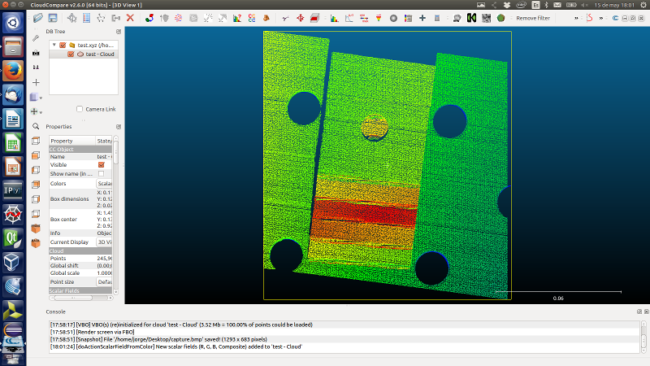

# Etna

Etna meta-package contains packages and libraries for supporting LMD automation 
based on [ROS-Industrial](http://www.ros.org/wiki/Industrial).

This meta-package currently contains packages that provide nodes and libraries 
for on-line scanning and off-line path programming for ABB industrial robots. It
also includes utilities and tools that are useful for scanning recording and
post-processing.

## Contents

This meta-package is composed by four packages:
- etna_workcell: contains the working cell description files.
- etna_scanning: contains the on-line scanning tool for LMD monitoring.
- etna_calib: contains the 3D calibration tools required for scanning.
- etna_cloud: contains some useful tools used for 3D filtering.
- etna_planning: contains the off-line path planning tool for LMD automation.

[INDIN 2015 presentation](./etna_scanning/doc/RobEyeEtna.pdf)

